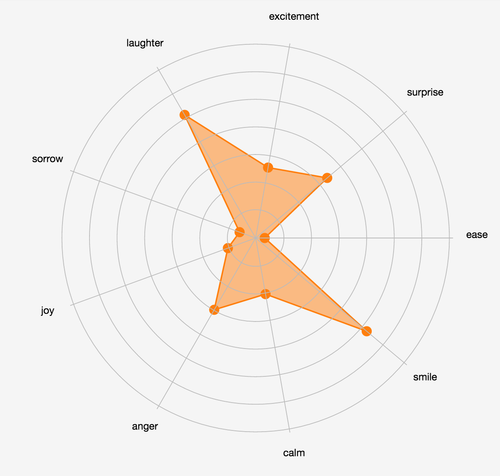

# Emotion Graph

This D3 graph is showing the emotions given by Pepper's ALMood serive.



## Install

`npm`, `bower` and `gulp` need to be installed. Install all dependencies by:
```
npm install
bower install
```

Edit the `buildDir` variable in `Gulpfile.js` to the correct Pepper html folder of your Choregraph project.

```
gulp build
```

Open index.html in the webview using Choregraph or Pepper.

